# Resource Relationships

This diagram shows all `has_one`, `has_many`, and `belongs_to` relationships between DIDWW API v3 resources.

**Legend:**
- `||--o|` — has_one (one-to-zero-or-one)
- `||--o{` — has_many (one-to-many)
- `}o--||` — belongs_to (many-to-one)

```mermaid
erDiagram
    Address ||--o| Identity : "has_one identity"
    Address ||--o| Country : "has_one country"
    Address ||--o{ Proof : "has_many proofs"
    Address ||--o{ City : "has_many city"
    Address ||--o{ Area : "has_many area"

    AddressVerification ||--o| Address : "has_one address"
    AddressVerification ||--o{ Did : "has_many dids"
    AddressVerification ||--o{ EncryptedFile : "has_many onetime_files"

    Area ||--o| Country : "has_one country"

    AvailableDid ||--o| DidGroup : "has_one did_group"
    AvailableDid ||--o| NanpaPrefix : "has_one nanpa_prefix"

    CapacityPool ||--o{ Country : "has_many countries"
    CapacityPool ||--o{ SharedCapacityGroup : "has_many shared_capacity_groups"
    CapacityPool ||--o{ QtyBasedPricing : "has_many qty_based_pricings"

    City ||--o| Country : "has_one country"
    City ||--o| Region : "has_one region"
    City ||--o| Area : "has_one area"

    Country ||--o{ Region : "has_many regions"

    Did ||--o| DidGroup : "has_one did_group"
    Did ||--o| Order : "has_one order"
    Did ||--o| VoiceInTrunk : "has_one voice_in_trunk"
    Did ||--o| VoiceInTrunkGroup : "has_one voice_in_trunk_group"
    Did ||--o| CapacityPool : "has_one capacity_pool"
    Did ||--o| SharedCapacityGroup : "has_one shared_capacity_group"
    Did ||--o| AddressVerification : "has_one address_verification"

    DidGroup ||--o| Country : "has_one country"
    DidGroup ||--o| City : "has_one city"
    DidGroup ||--o| DidGroupType : "has_one did_group_type"
    DidGroup ||--o| Region : "has_one region"
    DidGroup ||--o{ StockKeepingUnit : "has_many stock_keeping_units"

    DidReservation ||--o| AvailableDid : "has_one available_did"

    Identity ||--o| Country : "has_one country"
    Identity ||--o{ Proof : "has_many proofs"
    Identity ||--o{ Address : "has_many addresses"
    Identity ||--o{ PermanentSupportingDocument : "has_many permanent_documents"

    NanpaPrefix ||--o| Country : "has_one country"
    NanpaPrefix ||--o| Region : "has_one region"

    PermanentSupportingDocument ||--o| SupportingDocumentTemplate : "has_one template"
    PermanentSupportingDocument ||--o| Identity : "has_one identity"
    PermanentSupportingDocument ||--o{ EncryptedFile : "has_many files"

    Proof ||--o| ProofType : "has_one proof_type"
    Proof ||--o{ EncryptedFile : "has_many files"

    QtyBasedPricing }o--|| CapacityPool : "belongs_to capacity_pool"

    Region ||--o| Country : "has_one country"

    Requirement ||--o| Country : "has_one country"
    Requirement ||--o| DidGroupType : "has_one did_group_type"
    Requirement ||--o| SupportingDocumentTemplate : "has_one personal_permanent_document"
    Requirement ||--o| SupportingDocumentTemplate : "has_one business_permanent_document"
    Requirement ||--o| SupportingDocumentTemplate : "has_one personal_onetime_document"
    Requirement ||--o| SupportingDocumentTemplate : "has_one business_onetime_document"
    Requirement ||--o{ ProofType : "has_many personal_proof_types"
    Requirement ||--o{ ProofType : "has_many business_proof_types"
    Requirement ||--o{ ProofType : "has_many address_proof_types"

    RequirementValidation ||--o| Requirement : "has_one requirement"
    RequirementValidation ||--o| Address : "has_one address"
    RequirementValidation ||--o| Identity : "has_one identity"

    SharedCapacityGroup ||--o| CapacityPool : "has_one capacity_pool"
    SharedCapacityGroup ||--o{ Did : "has_many dids"

    StockKeepingUnit }o--|| DidGroup : "belongs_to did_group"

    VoiceInTrunk ||--o| Pop : "has_one pop"
    VoiceInTrunk ||--o| VoiceInTrunkGroup : "has_one voice_in_trunk_group"

    VoiceInTrunkGroup ||--o{ VoiceInTrunk : "has_many voice_in_trunks"

    VoiceOutTrunk ||--o| Did : "has_one default_did"
    VoiceOutTrunk ||--o{ Did : "has_many dids"

    VoiceOutTrunkRegenerateCredential ||--o| VoiceOutTrunk : "has_one voice_out_trunk"
```

## Resource Summary

| Resource | has_one | has_many | belongs_to |
|----------|---------|----------|------------|
| Address | identity, country | proofs, city, area | — |
| AddressVerification | address | dids, onetime_files | — |
| Area | country | — | — |
| AvailableDid | did_group, nanpa_prefix | — | — |
| Balance | — | — | — |
| CapacityPool | — | countries, shared_capacity_groups, qty_based_pricings | — |
| City | country, region, area | — | — |
| Country | — | regions | — |
| Did | did_group, order, voice_in_trunk, voice_in_trunk_group, capacity_pool, shared_capacity_group, address_verification | — | — |
| DidGroup | country, city, did_group_type, region | stock_keeping_units | — |
| DidGroupType | — | — | — |
| DidReservation | available_did | — | — |
| EncryptedFile | — | — | — |
| Export | — | — | — |
| Identity | country | proofs, addresses, permanent_documents | — |
| NanpaPrefix | country, region | — | — |
| Order | — | — | — |
| PermanentSupportingDocument | template, identity | files | — |
| Pop | — | — | — |
| Proof | proof_type | files | — |
| ProofType | — | — | — |
| PublicKey | — | — | — |
| QtyBasedPricing | — | — | capacity_pool |
| Region | country | — | — |
| Requirement | country, did_group_type, personal_permanent_document, business_permanent_document, personal_onetime_document, business_onetime_document | personal_proof_types, business_proof_types, address_proof_types | — |
| RequirementValidation | requirement, address, identity | — | — |
| SharedCapacityGroup | capacity_pool | dids | — |
| StockKeepingUnit | — | — | did_group |
| SupportingDocumentTemplate | — | — | — |
| VoiceInTrunk | pop, voice_in_trunk_group | — | — |
| VoiceInTrunkGroup | — | voice_in_trunks | — |
| VoiceOutTrunk | default_did | dids | — |
| VoiceOutTrunkRegenerateCredential | voice_out_trunk | — | — |
